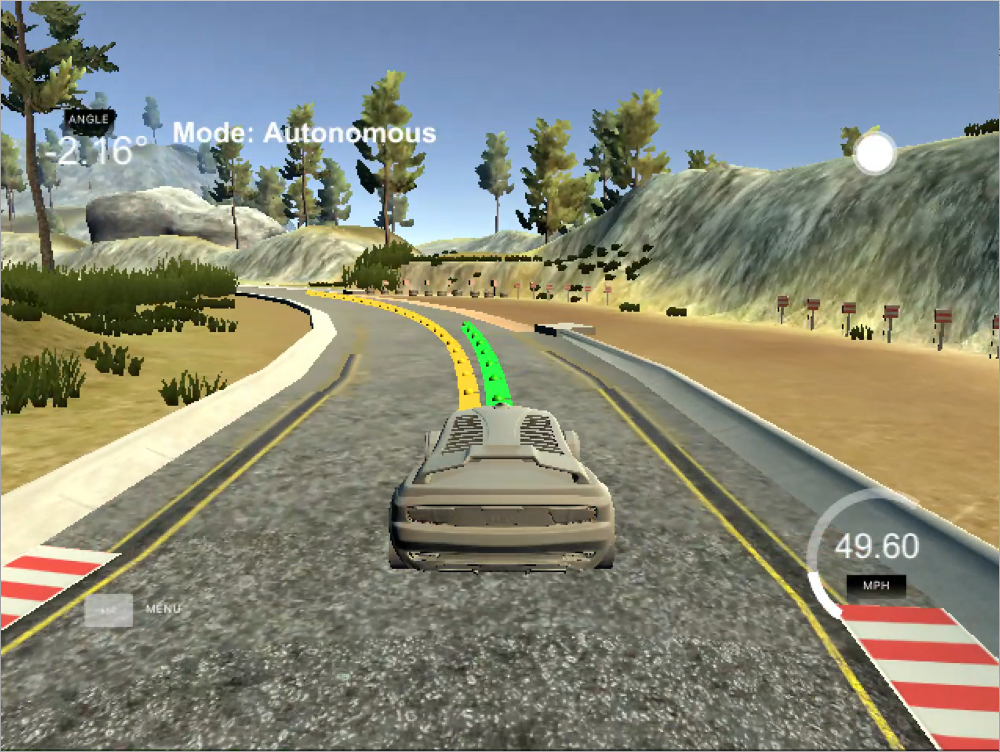

# Model Predictive Controller
This is a model predictive controller (MPC) for 2D vehicle trajectories implemented in C++.

---


The controller steers a car around a race track in the simulator linked below. The yellow line shows the reference trajectory, the green line shows the controller's projected trajectory based on the sequence of actuations computed by the optimizer.

## 1. Dependencies

* cmake >= 3.5
  * All operating systems: [Click here for installation instructions](https://cmake.org/install/)
* make >= 4.1
  * Linux: `make` is installed by default on most Linux distros
  * Mac: [Install Xcode command line tools to get make](https://developer.apple.com/xcode/features/)
  * Windows: [Click here for installation instructions](http://gnuwin32.sourceforge.net/packages/make.htm)
* gcc/g++ >= 5.4
  * Linux: `gcc` / `g++` is installed by default on most Linux distros
  * Mac: Same deal as `make` - [install Xcode command line tools]((https://developer.apple.com/xcode/features/)
  * Windows: It is recommended to use [MinGW](http://www.mingw.org/)
* [uWebSockets](https://github.com/uWebSockets/uWebSockets): Handles the communication between the program and the simulator.
  * Run either `install-mac.sh` or `install-ubuntu.sh`.
  * If you install from source, checkout to commit `e94b6e1`, i.e.
    ```
    git clone https://github.com/uWebSockets/uWebSockets
    cd uWebSockets
    git checkout e94b6e1
    ```
    Some function signatures have changed in v0.14.x. See [this PR](https://github.com/udacity/CarND-MPC-Project/pull/3) for more details.
* Fortran Compiler
  * Mac: `brew install gcc` (might not be required)
  * Linux: `sudo apt-get install gfortran`. Additionally you also have to install `gcc` and `g++`, `sudo apt-get install gcc g++`. Look in [this Dockerfile](https://github.com/udacity/CarND-MPC-Quizzes/blob/master/Dockerfile) for more info.
* [Ipopt](https://projects.coin-or.org/Ipopt)
  * Mac: `brew install ipopt`
  * Linux
    * You will need version 3.12.1 or higher of Ipopt. The version available through `apt-get` is 3.11.x. If you can get that version to work, great, but if not there's a script `install_ipopt.sh` that will install Ipopt. You just need to download the source from the [Ipopt releases page](https://www.coin-or.org/download/source/Ipopt/) or the [Github releases page](https://github.com/coin-or/Ipopt/releases).
    * Then call `install_ipopt.sh` with the source directory as the first argument, e.g.: `bash install_ipopt.sh Ipopt-3.12.1`.
  * Windows: TODO. If you can, use the Linux subsystem and follow the Linux instructions.
* [CppAD](https://www.coin-or.org/CppAD/)
  * Mac: `brew install cppad`
  * Linux `sudo apt-get install cppad` or equivalent.
  * Windows: TODO. If you can, use the Linux subsystem and follow the Linux instructions.
* [Eigen](http://eigen.tuxfamily.org/index.php?title=Main_Page). This is already part of the repo so you shouldn't have to worry about it.
* The simulator, which you can download from [here](https://github.com/udacity/self-driving-car-sim/releases).

## 2. Basic Build Instructions

1. Clone this repo.
2. Make a build directory: `mkdir build && cd build`
3. Compile: `cmake .. && make`
4. Run it: `./mpc`.

## 3. Demo Video

You can watch a demo video of this controller implementation driving a car around a race track in the simulator linked above [here](https://youtu.be/KqvLR3P7b1A).

The controller shown in the video is set to try to keep a target speed of 70 mph. The occasional jitter of the reference trajectory, which in turn leads to suboptimal controller commands, is owed to my weak laptop CPU.

The hyper parameters of the controller and their chosen values are explained below.

## 4. Implementation

This section contains a brief explanation of some design details of this controller implementation. For a general explanation of model predictive control, see [here](https://en.wikipedia.org/wiki/Model_predictive_control).

MPC solves control as an optimization problem. Using an appropriate motion model, it computes a vehicle's predicted state for a finite number of time steps in the future. The optimization problem consists of choosing the vehicle's actuator controls (throttle/braking and steering) so that the predicted state at each time step given the motion model is as close as possible to the desired state of the reference trajectory.

### 4.1 General code layout

Note: The program works, but the code needs to be refactored.

The controller itself consists of two main building blocks:

1. The `MPC` class, whose only member is a `Solve()` method. This method uses the Ipopt library linked above to solve the optimization problem of finding the optimal sequence of throttle and steering actuations for a finite number of time steps in order for a vehicle to follow a given reference trajectory.
2. The `FG_eval` class, an instance of which is passed to the `Solve()` method of the MPC class. The `FG_eval` object defines the cost function and the variable constraints of the optimization problem. The variable constraints are given by a kinematic vehicle motion model. You can find the definition of the motion model in the in-line comments of the `FG_eval` class.

### 4.2 The cost function

The cost function takes the following components into account:

1. The cross-track error, which is the orthogonal distance between the reference trajectory curve and the vehicle.
2. The orientation error, which is the difference between the vehicle's actual orientation and the orientation the vehicle should have if it followed the reference trajectory.
3. The velocity error, which is the difference between the desired velocity and the vehicle's actual velocity.
4. The steering actuation value.
5. The throttle actuation value.
6. The steering actuation change rate.
7. The throttle actuation change rate.

The optimizer seeks to minimize all of the above. Minimization of the last four components serves to yield smooth driving behavior. By minimizing the use of the actuators and minimizing the change of actuation over time, the optimizer avoids extreme actuation values or abrupt changes in steering angles or throttle.

### 4.3 Cost function weights

The individual cost function components are weighted according to the following weights, which were found to work well up to a target speed of 80 mph:

| Component            | Value   |
| -------------------- | ------- |
| Cross-track error    | 100     |
| Orientation error    | 20,000  |
| Velocity error       | 1,000   |
| Steering value       | 50,000  |
| Throttle value       | 1       |
| Steering change rate | 40,000  |
| Throttle change rate | 1       |

Explanation:

While it might seem intuitive to assign a large weight to the cross-track error, the orientation error is actually a lot more important for a smooth driving experience if we can afford to deviate slightly from the reference trajectory, which, in this race track scenario, we can. If the weight of the cross-track error is very large, the controller will aggressively try to steer back exactly to the reference trajectory. In this scenario though, we care more about the car heading in the **direction** of the reference trajectory rather than the car being precisely **on** the reference trajectory. In a regular street traffic scenario, following the reference trajectory extremely closely will usually be critical, so that a higher CTE weight would be appropriate in this case.

The high values for the steering value and the steering change rate force the controller to follow a smooth trajectory. Keeping the steering values minimal means the optimizer will prefer a sequence of many small steering actuations over few large steering actuations. Keeping the steering angle change rate minimal means the optimizer will prefer smooth turns over abrupt turns. These two weights are the single most important weights in this cost function.

There is one thing to note though: While larger weights for steering value and steering change rate lead to smoother driving behavior, at a certain point the number of optimization time steps needs to be increased in order to obtain a good solution. If the controller is allowed to turn less and less strongly and less and less abruptly, then it needs to look further into the future in order to plan further ahead. You can see in the video linked below that my choice of weights leads the car to react too late to sharp turns, because the optimizer is forced to steer softly initially and only once the car is already in the middle of the sharp turn, the optimizer "realizes" that more extreme steering angles are needed. A longer time horizon would ameliorate this issue, but my laptop CPU is too weak for that.

### 4.4 Optimization time horizon

The model computes the vehicle state at `N = 10` time steps in the future, where each time step has a length of `dt = 0.1` seconds, i.e the model takes into account the next 1.0 seconds for which to compute the optimal sequence of actuations. These values are defined at the top of `MPC.cpp`.

There is a trade-off to take into account for both of these values. Increasing the number of time steps `N` allows the optimizer to take a longer stretch of the future reference trajectory into account when computing the optimal actuation values for the present, but it also increases the computation time for the optimizer, a critical factor for a controller that needs to run in real time. The added value of looking into the future beyond a certain time frame will be negligible, since (1) the inaccuracy of any given motion model will make computations too far into the future pointless and (2) at most normal driving speeds the next one or two seconds will take into account enough of the reference path ahead to make good actuation decisions. Insofar, keeping the computation time to a minimum weighs heavier than the added value of increasing the number of time steps.

As with any discrete approximation to a continuous problem, increasing the resolution improves the approximation. Decreasing the duration of the time steps allows more frequent actuations and hence better optimization results, but it also decreases the future time frame taken into account for any fixed number of time steps. 0.1 seconds turns out to be a sufficient temporal resolution.

Before choosing these final values, I tried 20 time steps of both 0.05 and 0.1 seconds, but the computational cost was too high given the moderate improvement. My weak laptop CPU already affects other aspects of the real-time optimization to an extent such that increasing `N` and decreasing `dt` doesn't move the needle much.

### 4.5 Coordinate transformations

The optimizer works entirely with vehicle coordinates (as opposed to map coordinates), i.e. with a Cartesian coordinate system that has the vehicle at its origin, where the x-axis points in the direction of the vehicle's heading, the y-axis points to the left, and the vehicle's orientation is measured against the positive x-axis with counter-clockwise angles being positive.

Since the simulator provides the reference trajectory points in global map coordinates, these need to be transformed into vehicle coordinates. This transformation is performed and explained in lines 116-138 of `main.cpp`.

### 4.6 Latency

The model is able to compensate for systemic latency. This is done by projecting each measured vehicle state into the future by the latency time using the vehicle motion model. This projected state is then used as the current state.

The latency compensation is performed in lines 95-107 of `main.cpp`. The simulator has a built-in systemic latency of 100 milliseconds. The implemented compensation yields a drastic improvement in the controller's quality.

If the latency were not compensated for, the vehicle's next actuation value computed by the optimizer would be based on the vehicle's past state instead of its present state and thus erroneous. The effect would be that the vehicle would oscillate around the reference trajectory.
